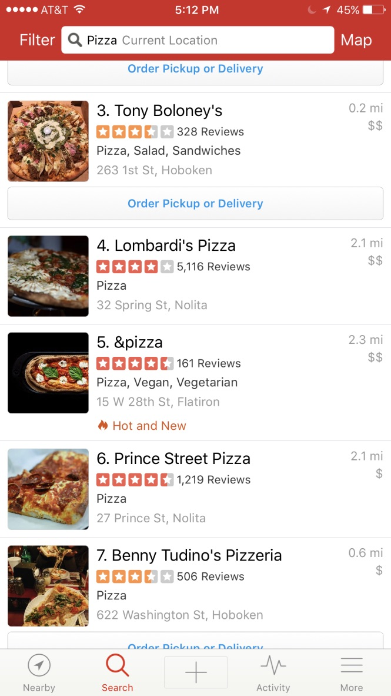
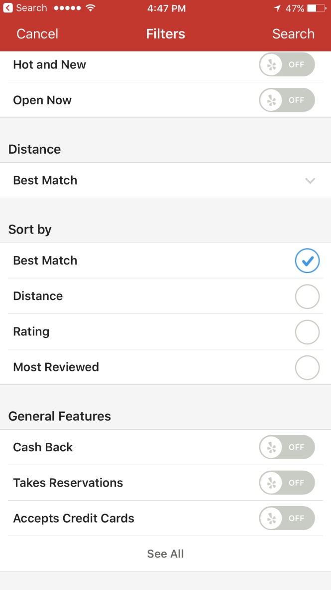
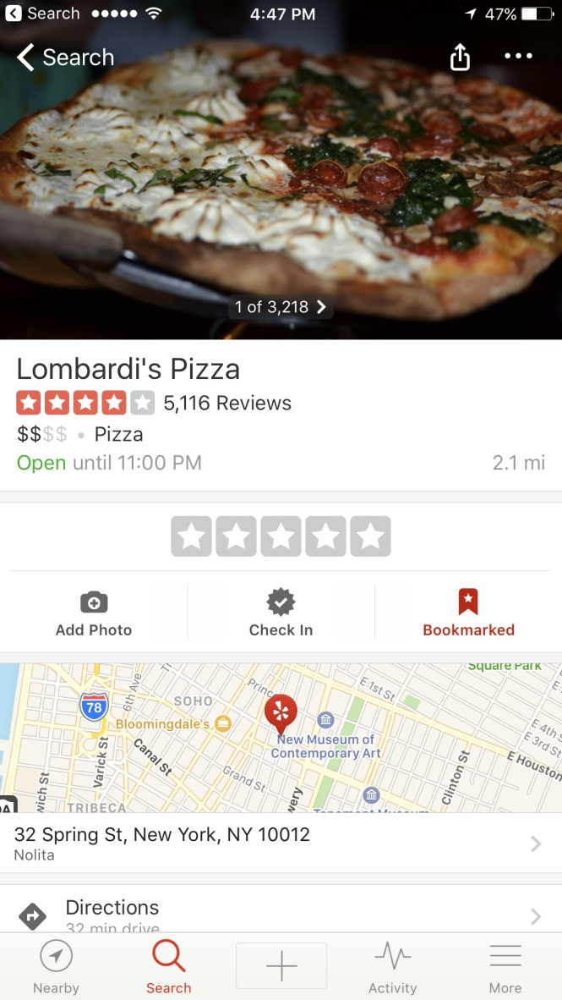

Coding Challenge Guidelines
===========================

Please organize, design, and submit your code as if it were going into production,
then send us a link to the hosted repository (e.g. Github, Bitbucket...).

We should be able to run the app in a simulator.

Functional spec
---------------

Prototype the following projects:

### Noteworth Lunch

1. Use the [Google Places API](https://developers.google.com/places/web-service/intro).
1. A user should be presented with a list of restaurants based on the food type
and the location they enter.
2. A user should be able to sort the list by Best Match, Distance, and Most Reviewed.
3. A user should be taken to a details page of the restaurant based on the restaurant
they select.

An adequate solution might be developed within 4 - 8 hours, but please spend however much time it takes to construct a great solution.

Technical spec
--------------

For **iOS** use the following technologies:

1. Swift
2. Cocoapods

For **Android** use the following technologies:
1. Java

High Level UI UX Requirements
-----------------------------

You can use the Yelp app to get insperation on how to present the List, 
Sorting, and Details page. Feel free to add your own flavor to the app, but use 
these screenshots to get started.

  

How will we review?
-------------------

[Guidelines can be found here](https://github.com/datamindedsolutions/coding-challenge)
